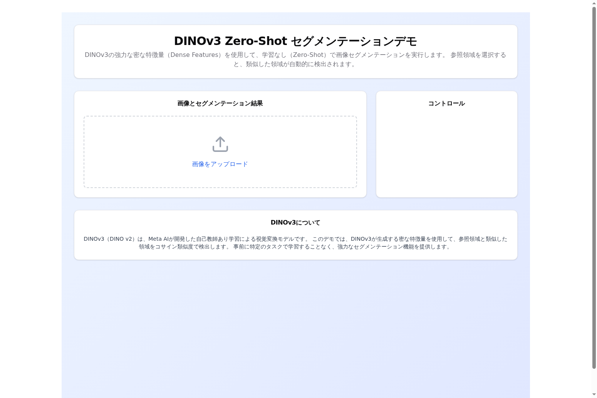
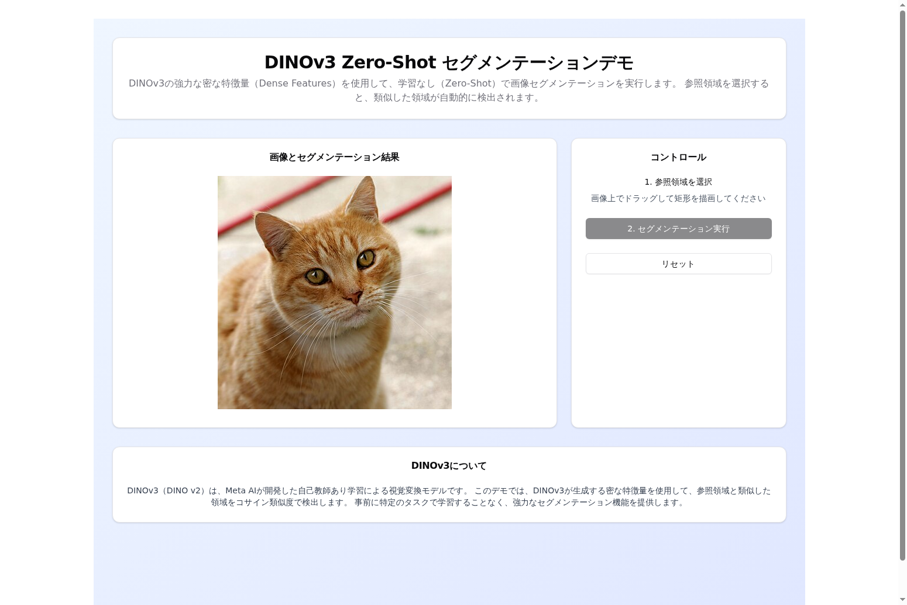
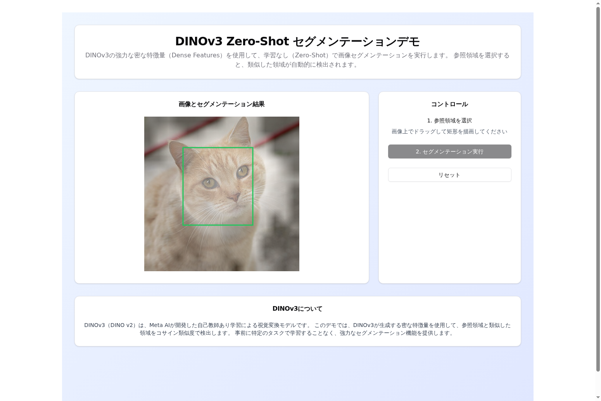

# DINOv3 Zero-Shot セグメンテーションデモ

DINOv3の強力な密な特徴量（Dense Features）を利用して、学習なし（Zero-Shot）で画像セグメンテーションを実行するデモアプリケーションです。

## 概要

このプロジェクトは、Meta AIが開発したDINOv2（DINOv3とも呼ばれる）モデルを使用して、画像上の参照領域と類似した領域を自動的に検出します。事前学習済みモデルの密な特徴量とコサイン類似度を用いることで、特定のタスクに対する追加学習なしでセグメンテーションを実行できます。

## 主な機能

- **画像アップロード**: 任意の画像をアップロードして処理
- **参照領域選択**: マウスドラッグで矩形を描画し、参照パッチを指定
- **Zero-Shotセグメンテーション**: DINOv2の特徴量を使用して類似領域を自動検出
- **マスク表示**: セグメンテーション結果を元画像にオーバーレイ表示
- **透明度調整**: スライダーでマスクの透明度を調整可能

## デモンストレーション

以下は、アプリケーションの動作を示すスクリーンショットです。

### 1. 初期画面
アプリケーション起動時の画面です。画像アップロードボタンが表示されています。



### 2. 画像アップロード
画像をアップロードすると、キャンバスに表示されます。参照領域の選択が可能になります。



### 3. 参照領域の選択
マウスドラッグで矩形を描画し、セグメンテーションの参照領域を指定します。この例では、猫の顔部分を参照領域として選択しています。


### 4. セグメンテーション結果
「セグメンテーション実行」ボタンをクリックすると、DINOv2モデルが参照領域と類似した部分を検出し、セグメンテーションマスクとして表示します。参照領域（猫の顔）と類似した特徴を持つ領域が明るく表示されています。



### デモ動作の特徴
- **Zero-Shot**: 事前学習なしで、参照領域に類似した領域を自動検出
- **リアルタイム処理**: 数秒でセグメンテーション結果を取得
- **視覚的フィードバック**: 透明度調整可能なマスクオーバーレイ表示
- **インタラクティブUI**: マウス操作で直感的に参照領域を選択可能

## 技術スタック

### バックエンド
- **Python 3.12**
- **FastAPI**: 高速なWeb APIフレームワーク
- **PyTorch 2.8.0**: 深層学習フレームワーク
- **Transformers 4.57.0**: Hugging Faceのモデルライブラリ
- **DINOv2モデル**: `facebook/dinov2-base` (Hugging Face)

### フロントエンド
- **React 18** + **TypeScript**
- **Vite**: 高速ビルドツール
- **Tailwind CSS**: ユーティリティファーストCSSフレームワーク
- **shadcn/ui**: モダンなUIコンポーネントライブラリ

### デプロイメント
- **Docker** + **Docker Compose**
- **Nginx**: フロントエンドの静的ファイル配信

## システム要件

### 必須
- **Windows 10/11** (64-bit)
- **Docker Desktop for Windows** (最新版推奨)
- **WSL2** (Windows Subsystem for Linux 2)
- **メモリ**: 最低8GB RAM（16GB以上推奨）
- **ストレージ**: 10GB以上の空き容量

### GPU使用時（オプション）
- **NVIDIA GPU** (CUDA対応)
- **NVIDIA Driver** (最新版)
- **NVIDIA Container Toolkit**

## セットアップ手順

### 1. Docker Desktop for Windowsのインストール

1. [Docker Desktop for Windows](https://www.docker.com/products/docker-desktop/)をダウンロード
2. インストーラーを実行し、指示に従ってインストール
3. インストール完了後、Dockerを起動
4. WSL2バックエンドが有効になっていることを確認

### 2. リポジトリのクローン

```bash
git clone https://github.com/OK-BluStellar/DINOv3DemoOnWindowsDocker_v1.git
cd DINOv3DemoOnWindowsDocker_v1
```

### 3. アプリケーションの起動

Docker Composeを使用してバックエンドとフロントエンドを同時に起動します：

```bash
docker-compose up --build
```

初回起動時は、Dockerイメージのビルドとモデルのダウンロードに時間がかかります（10〜15分程度）。

### 4. アプリケーションへのアクセス

ブラウザで以下のURLにアクセスします：

- **フロントエンド**: http://localhost:3000
- **バックエンドAPI**: http://localhost:8000
- **APIドキュメント**: http://localhost:8000/docs

### 5. 使用方法

1. **画像をアップロード**: 「画像をアップロード」ボタンをクリックして画像を選択
2. **参照領域を選択**: 画像上でマウスをドラッグして矩形を描画
3. **セグメンテーション実行**: 「セグメンテーション実行」ボタンをクリック
4. **結果の確認**: セグメンテーションマスクが画像上にオーバーレイ表示されます
5. **透明度調整**: スライダーでマスクの透明度を調整できます

## GPU対応（オプション）

### Windows + WSL2でのGPU使用

Windows 11およびWindows 10（バージョン21H2以降）では、WSL2を通じてDockerコンテナからGPUにアクセスできます。

#### 前提条件
1. **NVIDIA GPU**がインストールされている
2. **NVIDIA Driver**（最新版）がWindowsにインストールされている
3. **WSL2**が有効になっている

#### セットアップ手順

1. **NVIDIA Container Toolkitのインストール（WSL2内）**

WSL2のUbuntuターミナルで以下を実行：

```bash
# リポジトリの設定
distribution=$(. /etc/os-release;echo $ID$VERSION_ID)
curl -fsSL https://nvidia.github.io/libnvidia-container/gpgkey | sudo gpg --dearmor -o /usr/share/keyrings/nvidia-container-toolkit-keyring.gpg
curl -s -L https://nvidia.github.io/libnvidia-container/$distribution/libnvidia-container.list | \
    sed 's#deb https://#deb [signed-by=/usr/share/keyrings/nvidia-container-toolkit-keyring.gpg] https://#g' | \
    sudo tee /etc/apt/sources.list.d/nvidia-container-toolkit.list

# インストール
sudo apt-get update
sudo apt-get install -y nvidia-container-toolkit

# Dockerの設定
sudo nvidia-ctk runtime configure --runtime=docker
sudo systemctl restart docker
```

2. **docker-compose.ymlの変更**

`docker-compose.yml`のbackendサービスに以下を追加：

```yaml
services:
  backend:
    # ... 既存の設定 ...
    deploy:
      resources:
        reservations:
          devices:
            - driver: nvidia
              count: 1
              capabilities: [gpu]
```

3. **動作確認**

```bash
docker run --rm --gpus all nvidia/cuda:11.8.0-base-ubuntu22.04 nvidia-smi
```

GPUが正しく認識されていれば、nvidia-smiの出力が表示されます。

### 注意事項

- GPU使用時はVRAMを大量に消費します（最低4GB、推奨8GB以上）
- GPUが利用できない環境でもCPUで動作しますが、処理時間が長くなります
- 初回実行時はモデルのダウンロードに時間がかかります（約3GB）

## DINOv2モデルについて

このデモでは、Meta AIが開発した**DINOv2（facebook/dinov2-base）**モデルを使用しています。

### モデルの特徴
- **自己教師あり学習**: ラベルなしデータから特徴量を学習
- **密な特徴量**: 画像の各パッチから高品質な特徴ベクトルを抽出
- **汎用性**: 様々な下流タスクに適用可能
- **Zero-Shot能力**: 追加学習なしで新しいタスクに対応

### 処理フロー
1. 画像を14×14ピクセルのパッチに分割
2. 各パッチから768次元の特徴ベクトルを抽出
3. 参照領域のパッチ特徴量を平均化
4. 全パッチとのコサイン類似度を計算
5. 類似度マップを元の画像サイズにアップサンプリング

## トラブルシューティング

### Dockerが起動しない
- Docker Desktopが正しくインストールされているか確認
- WSL2が有効になっているか確認
- Windowsを再起動してみる

### モデルのダウンロードが遅い
- 初回起動時は約3GBのモデルをダウンロードするため時間がかかります
- ネットワーク接続を確認してください

### メモリ不足エラー
- Docker Desktopの設定でメモリ割り当てを増やす
- 他のアプリケーションを終了してメモリを確保

### ポートが使用中
- `docker-compose.yml`でポート番号を変更
- 例: `3000:80` → `3001:80`

## 開発

### ローカル開発環境

#### バックエンド

```bash
cd backend
poetry install
poetry run fastapi dev app/main.py
```

APIは http://localhost:8000 で起動します。

#### フロントエンド

```bash
cd frontend
npm install
npm run dev
```

開発サーバーは http://localhost:5173 で起動します。

### コンテナの停止

```bash
docker-compose down
```

コンテナとネットワークを削除する場合：

```bash
docker-compose down -v
```

## ライセンス

このプロジェクトはMITライセンスの下で公開されています。

## 謝辞

- Meta AIのDINOv2モデル
- Hugging Face Transformersライブラリ
- FastAPIとReactのコミュニティ

## お問い合わせ

問題や質問がある場合は、GitHubのIssuesでお知らせください。
